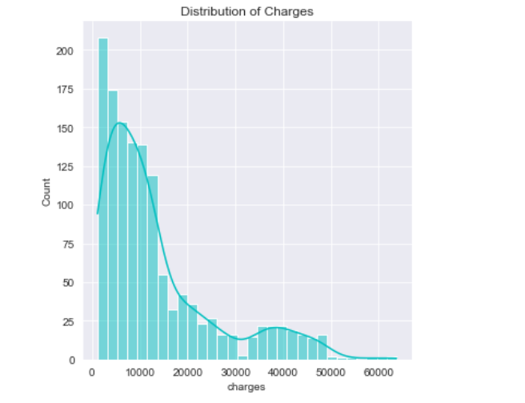
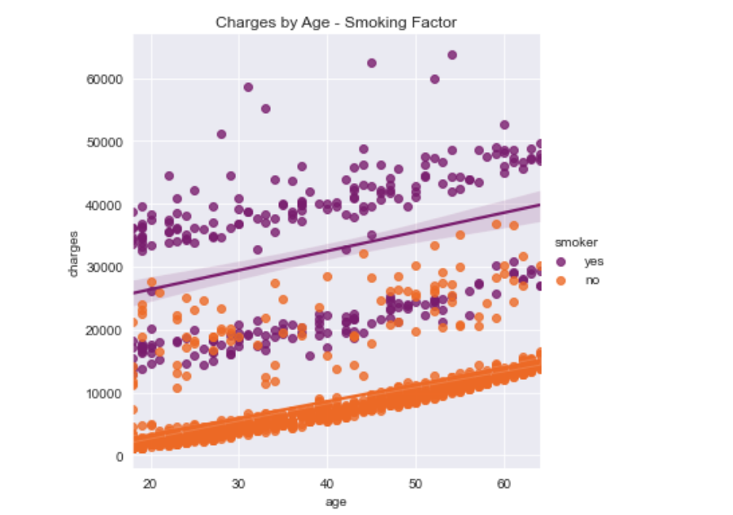
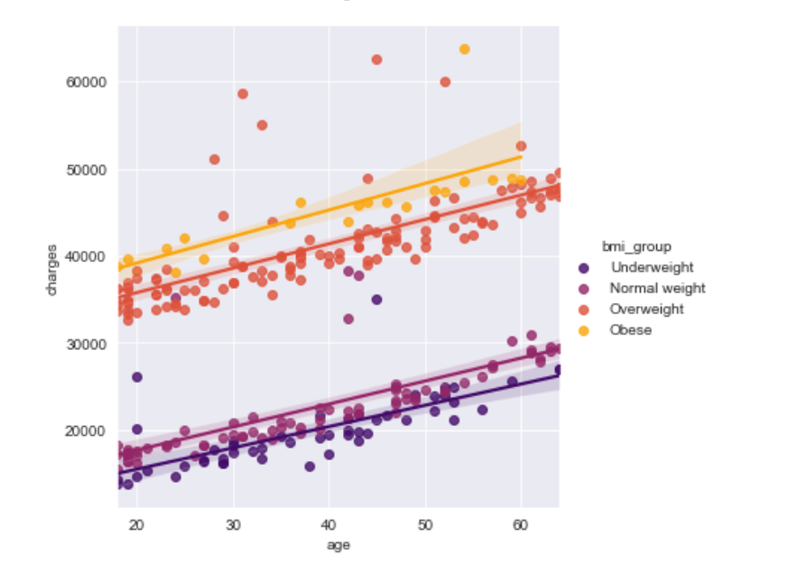
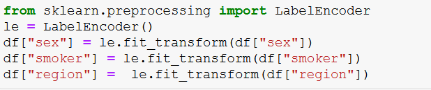
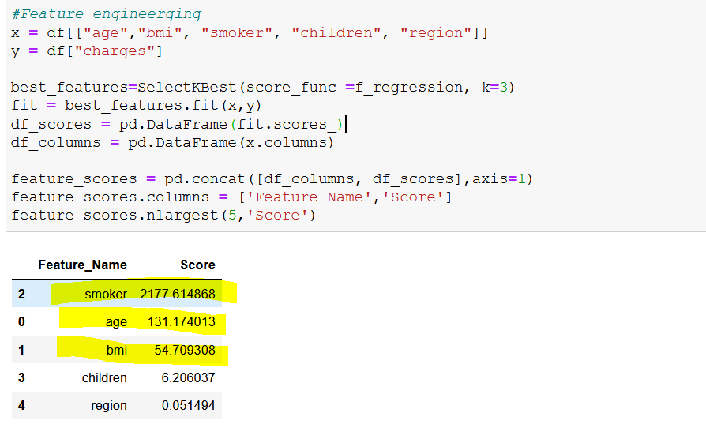
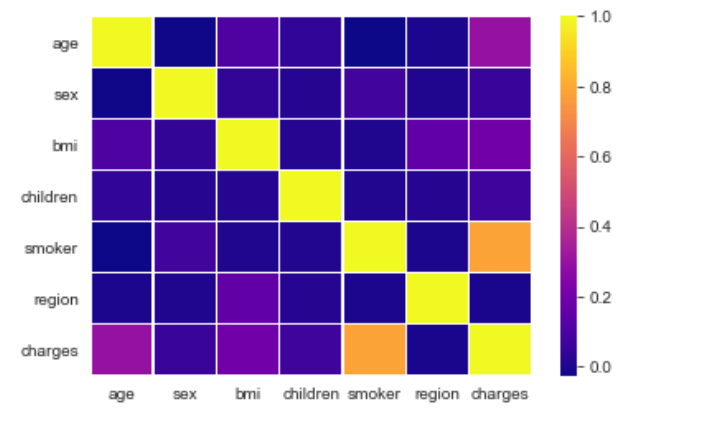
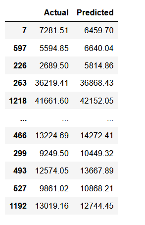
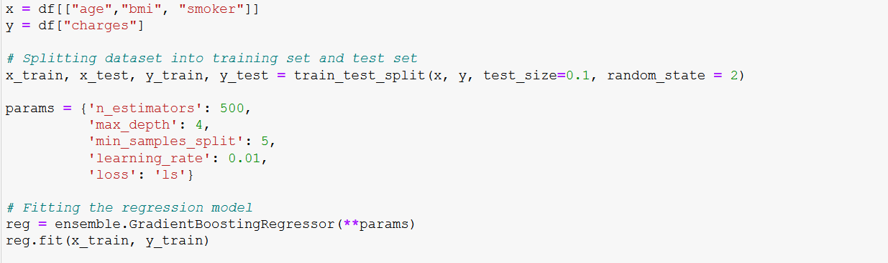

# Building Medical Insurance Cost Estimator - Project Overview

* Performed Exploratory Data Analysis (EDA) to get a better understanding of the input data
* Built a regression model 
* Evaluated the performance of the model using R-squared and MAE (mean average error)
* Built a Flask API to predict the insurance cost based on the inputs

## Code and Resources Used

* Python Version : 3.8.5  
* Packages: csv, pandas, numpy, matplotlib, seaborn, sklearn, statsmodels.api, pickle, flask, requests, json, LazyPredict
* Data source: insurance.csv (US Medical Insurance Costs)
* Flask Productionization: https://towardsdatascience.com/productionize-a-machine-learning-model-with-flask-and-heroku-8201260503d2

### Data Overview

This data set contains **1338 records** of insurance company customers and includes the following features: 
  * **Age** - Customer age 
  * **Sex** - Customer gender
  * **BMI** - Body Mass Index of the customer
  * **Children** - Number of children that are covered by insurance 
  * **Smoker** - Smoking status (yes, no)
  * **Region** - Residential area in the US
  * **Charges** - Individual medical costs  

## Exploratory Data Analysis (EDA)
  
> No data cleaning was required for this data set 

Included:  

* **Descriptive statistics** 
* **Data distribution and correlation**
* **Data visualisation with Matplotlib and Seaborn**

  
### Here are the key highlights:

* Smoking is a significant factor affecting the cost. Minimum and median insurance costs are considerably higher for smokers than for non-smoking clients
* Clients with 2 children have the highest maximum insurance costs in comparison to other groups
* Customers from the southeast region have the highest charges (4,012,754$ vs 5,363,689$)
* Southeast region also has the most smokers 
* Insurance costs are higher for customers without children 
* Older people (45-54 years-old) and overweight/obese customers have higher insurance costs

 

Based on the visualisations, we can see that the data is right-skewed and has outliers. 

If we look at a scatter plot showing charges by age and smoking status, we can see 2 different data clusters for both smoking and non-smoking data. This indicates that there is a certain data pattern that is worth investigating. 

To figure out the reason of this behaviour, I created a new dataframe including data only for smokers and then plotted this data adding such variables as gender, number of children and bmi group. Plots with gender and number of children variables didn't reveal anything - both of the data clusters has a mix of female/male clients as well as clients with different amount of children. However, a plot with bmi data shows us that there is a clear trend - data cluster with insurance costs over 30k has mainly overweight and obese people and data cluster with insurance costs below 30k includes people who are in normal and underweight bmi categories. Hence, we can say that bmi group contributed to this data pattern. 

## Model Building

For identifying the best suitable model for this data I used a Lazy Predict library that builds a lot of basic models and helps understand which models work best without any parameter tuning. Based on the results, I selected a LGBMRegressor model as it has the highest accuracy (based on adjusted R-squared results).

### Step by step

**1. First, I checked if the data set contains any categorical values.** 

If there are any categorical values, they need to be converted into numerical data (models require all input and output variables to be numeric):
As we see, columns "sex, "smoker" and "region" have categorical values so I used **LabelEncoder** to assign a unique integer to each label: 

**2. After that, I set the features and the target variable for our model.** 

Insurance costs will be the target ("predictable") variable and I selected age, smoking status and BMI index as the features as they have a stronger correlation with the insurance costs (see the heatmap below). Yellow - strong positive correlation.

To make sure that we should use these features for building the model, I also used SelectBest to score the features using a f-regression method. Smoker, age and bmi have the highest score. 

**3. Then, the data set was split into the training set and test set with a test size of 10%.**

> We need to add a random_state (a pseudo-random number) in here to make the output split the same every time we're running the code 

## Model Training and Testing

After building the model, I've tested it by comparing actual costs vs predicted costs and built the function that predicts the insurance costs based on the input age, bmi index and smoking status.

## Model Evaluation

The performance of the linear regression model was evaluated using Mean Absolute Error (MAE) and R-squared value. They were chosen because MAE is relatively easy to interpret and R-squared shows how well-fitted the model is.  

* **R-squared value** = 0.843 and is close to 1. It means that our model is well-fitted and the features that we selected at the very beginning are relevant and they are not blowing the overall model performance out of proportion. Age, smoking factor and BMI index affect the predictable value (charges) of 84.3%. 

## Model Deployment

I deployed a trained machine learning model by building a Flask API endpoint that was hosted on a local webserver. The API endpoint takes in a request with a list of values and returns an estimated insurance cost.

