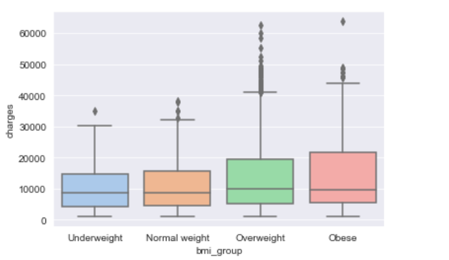
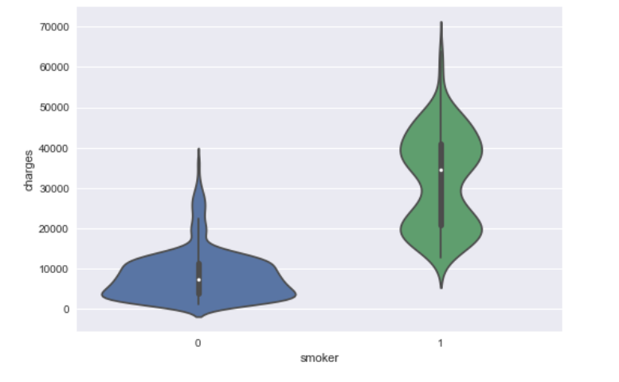

# Building Medical Insurance Cost Estimator - Project Overview

* Performed Exploratory Data Analysis (EDA) to get a better understanding of the input data
* Built a regression model 
* Evaluated the performance of the model using R-squared and MAE (mean average error)
* Built a Flask API to predict the insurance cost based on the inputs

## Code and Resources Used

* Python Version : 3.8.5  
* Packages: csv, pandas, numpy, matplotlib, seaborn, sklearn, statsmodels.api, pickle, flask, requests, json, LazyPredict
* Data source: insurance.csv (US Medical Insurance Costs)
* Flask Productionization: https://towardsdatascience.com/productionize-a-machine-learning-model-with-flask-and-heroku-8201260503d2

### Data Overview

This data set contains **1338 records** of insurance company customers and includes the following features: 
  * **Age** - Customer age 
  * **Sex** - Customer gender
  * **BMI** - Body Mass Index of the customer
  * **Children** - Number of children that are covered by insurance 
  * **Smoker** - Smoking status (yes, no)
  * **Region** - Residential area in the US
  * **Charges** - Individual medical costs  

## Exploratory Data Analysis (EDA)
  
> No data cleaning was required for this data set 

Included:  

* **Descriptive statistics** 
* **Data distribution and correlation**
* **Data visualisation with Matplotlib and Seaborn**

  
### Here are the key highlights:

* Smoking is a significant factor affecting the cost, with minimum and median insurance costs considerably higher for smokers compared to non-smoking clients.
* Clients with 2 children have the highest maximum insurance costs compared to other groups.
* Customers from the southeast region have the highest charges, with $4,012,754 in charges compared to $5,363,689 in charges for the southeast region.
* The southeast region also has the highest number of smokers.
* Insurance costs tend to be higher for customers without children.
* Older people (45-54 years old) and overweight/obese customers tend to have higher insurance costs.

These findings suggest that smoking status, number of children, region, age, and weight status are important factors that impact insurance costs. Further analysis and consideration of these factors may be valuable in understanding and predicting insurance costs for this dataset.

 

Based on the visualisations, it appears that the data is right-skewed and contains outliers. Additionally, the scatter plot showing charges by age and smoking status reveals two distinct data clusters for both smoking and non-smoking groups. This suggests that there may be a discernible pattern within the data that needs further investigation.

By creating a new dataframe for smokers and further exploring the data by adding variables such as gender, number of children, and BMI group, I was able to uncover a trend in the relationship between BMI and insurance costs.

Based on my findings, it appears that there is a clear trend in the data cluster with insurance costs over 30k, which mainly includes overweight and obese individuals. On the other hand, the data cluster with insurance costs below 30k includes individuals who fall into normal and underweight BMI categories. This suggests that BMI group is a contributing factor to the observed data pattern.

## Model Building

For identifying the best suitable model for this data, I used a Lazy Predict library that builds a lot of basic models and helps understand which models work best without any parameter tuning. Based on the results, I have selected a LGBMRegressor model, as determined by the adjusted R-squared results.

### Step by step process

**1. First, I checked if the data set contains any categorical values.** 

If there are any categorical values, they need to be converted into numerical data  as models require all input and output variables to be numeric.
Columns "sex, "smoker" and "region" have categorical values so I used **LabelEncoder** to assign a unique integer to each label. 

**2. After that, I set the features and the target variable for our model.** 

The insurance costs will be the target ("predictable") variable, and age, smoking status, and BMI index will be the features. I have selected them because they have a stronger correlation with the insurance costs (as seen in the heatmap below, where yellow indicates a strong positive correlation).

To ensure that we should use these features for building the model, I also used SelectKBest to score the features using an f-regression method. Smoker, age, and BMI have the highest scores, further validating their importance for our model.

**3. Then, the data set was split into the training set and test set with a test size of 10%.**

To ensure consistent results, a random_state (a pseudo-random number) was added to the code to ensure the same split every time the code is run. This helps with reproducibility and consistency in model evaluation.

## Model Training and Testing

After building the model, I tested it by comparing actual insurance costs vs predicted insurance costs. I also created a function that takes input values for age, BMI index, and smoking status, and uses the trained model to predict insurance costs based on these input features. This allows for making predictions on new data based on the learned patterns from the training data.

## Model Evaluation

The performance of the linear regression model was evaluated using Mean Absolute Error (MAE) and R-squared value. MAE was chosen as it is a simple and interpretable metric that measures the average absolute difference between predicted and actual values. R-squared value was also used as it provides an indication of how well the model is fitted to the data, with a higher value indicating a better fit. These evaluation metrics help assess the accuracy and goodness of fit of the linear regression model for predicting insurance costs based on the selected features.

* The R-squared value obtained for the model is 0.843, which is close to 1. This indicates that the model is well-fitted to the data, and the features (age, smoking status, and BMI index) selected at the beginning are relevant and have a significant impact on the predicted insurance costs (charges). The R-squared value of 0.843 means that approximately 84.3% of the variance in insurance costs can be explained by the selected features. This suggests that age, smoking status, and BMI index are important factors in predicting insurance costs in this dataset.

## Model Deployment

As part of the project, I also deployed the trained machine learning model to a Flask API endpoint, which was hosted on a local web server. This allowed for easy accessibility and utilisation of the model for estimating insurance costs.

The Flask API endpoint was designed to accept a request with a list of input values, such as age, BMI index, and smoking status. The model then processed the input values and returned an estimated insurance cost as the response. 

